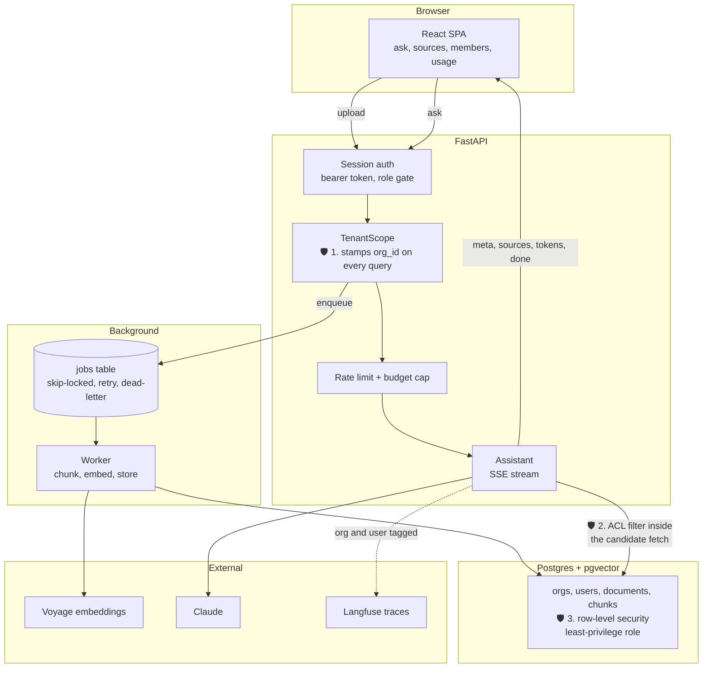
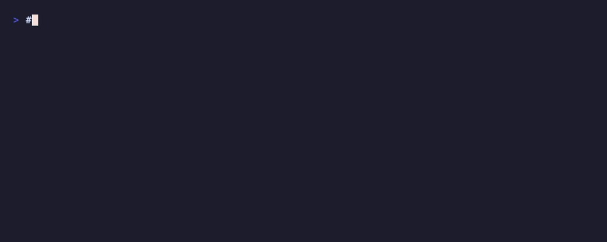

# Knowledge Desk

A multi-tenant, permissions-aware knowledge assistant. Each organization
connects its documents, the system indexes them per tenant, and users ask
questions and get grounded, cited answers drawn only from the documents they
are allowed to see.

This is a portfolio project about the operational layer around an LLM
application, not the retrieval technique. The interesting parts are tenancy,
access-controlled retrieval, background ingestion, quotas and cost attribution,
audit, and evals that gate merges. The RAG core is reused from earlier work.

## Status

Feature complete. See [PLAN.md](PLAN.md) for the phased build and the definition
of done for each phase, [WALKTHROUGH.md](WALKTHROUGH.md) for a narrated trip
through the app end to end (branch points, gotchas, and what it is and is not
good at), and [LESSONS.md](LESSONS.md) for what the build taught.

## Architecture

Ingestion is asynchronous, so embedding never blocks a request. Asking is
synchronous and streams. The interesting property is that a question can only
ever reach documents the asker is allowed to see, and that is enforced three
independent times (marked below), so no single missed filter leaks data.



The three shields are the whole point: the data layer filters by `org_id`, the
retrieval query filters by the caller's ACL in the same SQL that ranks
candidates (so forbidden rows are never scored), and row-level security denies
by default underneath both. A bug in any one of them is not a data leak.

## Stack

FastAPI, Postgres with pgvector, a Postgres-backed job queue and worker, React
plus Vite plus TypeScript, Voyage embeddings, Claude for answers, Langfuse for
observability, Docker, and GitHub Actions. Runs keyless with a loud mock
fallback, so it works and tests green with no API keys.

## Run it locally

For development, run the database in Docker and the app on the host:

```bash
docker compose up -d db                   # Postgres + pgvector on :5436
python -m knowledge_desk.migrate          # creates schema, RLS, and the app role
python check_setup.py                     # preflight
python -m knowledge_desk.seed             # two demo orgs (optional)

uvicorn knowledge_desk.main:app --reload  # API on :8000
python -m knowledge_desk.worker           # background embedder (separate shell)

cd frontend && npm install && npm run dev # UI on :5173 (set VITE_API_BASE=http://localhost:8000)
```

Or run the whole stack (API + built UI + worker + db) in containers:

```bash
docker compose up --build                 # app on http://localhost:8000
```

### Demo logins

After `python -m knowledge_desk.seed` (password `demo-password-123`):

| org | email |
|---|---|
| acme | owner@acme.test |
| globex | owner@globex.test |

Each org's documents are non-overlapping, so a question in one org can never
retrieve the other's content.

## Live demo

**https://knowledge-desk.fly.dev**



Recorded against the live deployment with `vhs demo.tape`, so every answer above
is a real Claude call over real retrieval. Acme's handbook answers the question.
Globex retrieves only its own documents and the assistant refuses rather than
reaching for the model's general knowledge, which is the permission boundary
holding all the way through to the generated text.

Log in with either account below (password `demo-password-123`) and ask
"how long do refunds take?" in both. Acme answers it with a citation; Globex
retrieves only its own documents and says it has nothing it is allowed to cite.
That refusal is the whole point of the project.

| org | email |
|---|---|
| acme | owner@acme.test |
| globex | owner@globex.test |

Running with real Claude answers and Voyage embeddings. The machine sleeps when
idle, so the first request after a quiet period pays a cold start.

Tenant isolation is enforced in three layers: the data layer's `org_id` filter,
the ACL-aware candidate fetch in retrieval, and Postgres row-level security
underneath (the app connects as a least-privilege role so RLS applies).

## Observability

With `LANGFUSE_*` keys set, each question emits one Langfuse trace tagged by org
and user: a retriever span that records how many of the org's chunks the caller
was allowed to see (the ACL filter, made visible), and the answer as a generation
with token usage and cost. Without keys it is a no-op, and every tracer call is
exception-proof, so observability can never take the product down.

## License

MIT. See [LICENSE](LICENSE).
